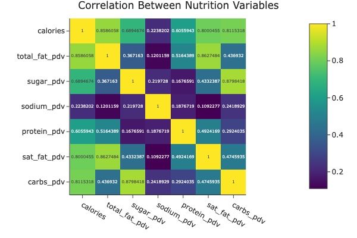
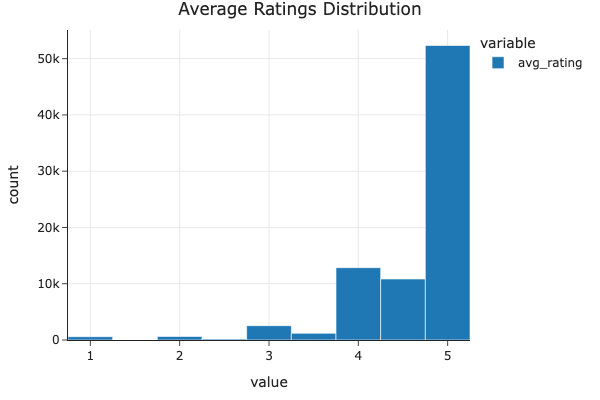
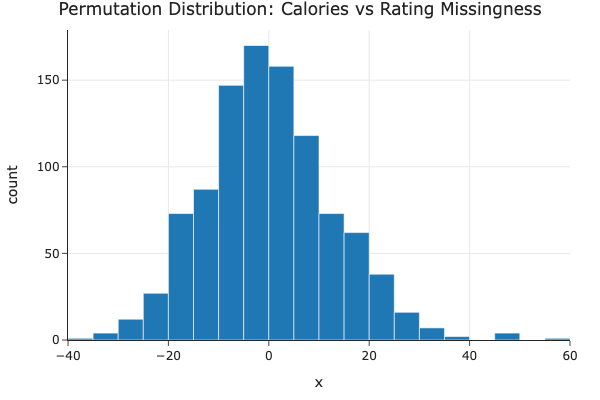
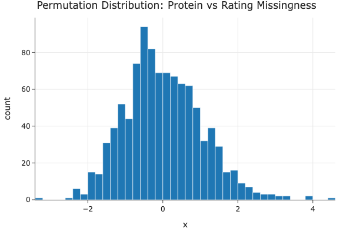

# Recipe Ratings Analysis
Giselle Carames  
DSC 80 Final Project

## Introduction

Eating is a central component of daily life, and many people rely on online platforms to discover and evaluate recipes. On websites like Food.com, users can rate recipes after trying them, creating a large dataset of community feedback. This project investigates whether there is a relationship between the **number of calories in a recipe** and the **average rating it receives**.

The main question explored in this analysis is:

**Is there a relationship between the number of calories in a recipe and the average rating it receives?**

To answer this question, I used two datasets from Food.com: a dataset of recipes and a dataset of user interactions and ratings.

### Recipes Dataset (`RAW_recipes.csv`)

This dataset contains **83,782 recipes** and **10 columns** describing each recipe.

**Relevant columns include:**

- **`name`** – Recipe name  
- **`id`** – Unique recipe identifier  
- **`minutes`** – Number of minutes required to prepare the recipe  
- **`contributor_id`** – User ID of the person who submitted the recipe  
- **`submitted`** – Date the recipe was submitted  
- **`tags`** – Food.com tags associated with the recipe  
- **`nutrition`** – Nutrition information in the format  
  `[calories (#), total fat (PDV), sugar (PDV), sodium (PDV), protein (PDV), saturated fat (PDV), carbohydrates (PDV)]`  
  *(PDV = Percentage of Daily Value)*  
- **`n_steps`** – Number of preparation steps in the recipe  
- **`steps`** – Text instructions for recipe preparation  
- **`description`** – User-provided description of the recipe  

### Interactions Dataset (`interactions.csv`)

This dataset contains **731,927 user interactions** where users rated and reviewed recipes.

**Relevant columns include:**

- **`user_id`** – Unique identifier for the user submitting the rating  
- **`recipe_id`** – Unique identifier for the recipe being rated  
- **`date`** – Date the user rated or reviewed the recipe  
- **`rating`** – Rating given by the user  
- **`review`** – Text review written by the user  

---

## Data Cleaning and Exploratory Data Analysis

To prepare the data for analysis, I first cleaned the ratings data and then extracted usable nutrition values from the recipes dataset.

The `rating` column in the merged dataset originally included `0` values. Since a rating of `0` does not represent a real recipe score, I replaced those values with `NaN` so they would not incorrectly affect averages.

Next, I grouped the merged dataset by recipe `id` and computed the mean rating for each recipe. This produced an `avg_rating` column that represents the average score each recipe received across all user ratings. I then merged these average ratings back into the recipes dataset using a left merge on `id`, so that each recipe retained its original information along with its average rating.

The `nutrition` column also required cleaning because its values were stored as strings representing lists rather than as separate numeric columns. I split this column into seven individual numeric columns:

- `calories`
- `total_fat_pdv`
- `sugar_pdv`
- `sodium_pdv`
- `protein_pdv`
- `sat_fat_pdv`
- `carbs_pdv`

While it did increase the number of columns, this cleaning step made it possible to directly analyze calories and other nutritional variables as quantitative features.

Finally, I removed several columns that would not be used throughout the analysis to make the head of the dataframe more readable and clean.

### Head of Cleaned DataFrame

| minutes | avg_rating | calories | total_fat_pdv | sugar_pdv | sodium_pdv | protein_pdv | sat_fat_pdv | carbs_pdv |
|--------|------------|----------|---------------|-----------|------------|-------------|-------------|-----------|
| 40 | 4.0 | 138.4 | 10.0 | 50.0 | 3.0 | 3.0 | 19.0 | 6.0 |
| 45 | 5.0 | 595.1 | 46.0 | 211.0 | 22.0 | 13.0 | 51.0 | 26.0 |
| 40 | 5.0 | 194.8 | 20.0 | 6.0 | 32.0 | 22.0 | 36.0 | 3.0 |
| 120 | 5.0 | 878.3 | 63.0 | 326.0 | 13.0 | 20.0 | 123.0 | 39.0 |
| 90 | 5.0 | 267.0 | 30.0 | 12.0 | 12.0 | 29.0 | 48.0 | 2.0 |

### HeatMap Analysis

This heatmap shows the correlations between the nutritional variables extracted from the `nutrition` column to become multiple columns. As expected, it can be seen that calories are strongly correlated with each broken down nutritional component. As this project investigates the relationship between calorie content and recipe ratings, these relationships provide context for how nutritional components translate into the calories, which will then be studied in relation to ratings.

### Distribution of Calories (Outliers Dropped)

Before generating this graph, the IQR of the calories distribution was calculated in order to generate new data without the outliers skewing the values. 

.png)

### Average Ratings Distribution

Here the general distribution of average ratings can be viewed to take into consideration when any skews are viewed later on as ratings will become a central variable in this analysis. 

### Bivariate Data Analysis

Before generating this graph, the IQR of the calories distribution was calculated in order to generate new data without the outliers skewing the values. 

.png)

This scatter plot shows the relationship between recipe calorie content and average rating after removing extreme calorie outliers. Ratings appear to remain relatively high across the full range of calorie values, and there is no clear linear trend. This suggests that calorie content alone does not strongly determine how highly a recipe is rated.

.png)

This histogram compares the distribution of average ratings for high-calorie and low-calorie recipes. Both groups show very similar rating patterns, with most recipes receiving ratings between 4 and 5. This indicates that recipes with higher calorie content do not receive systematically higher or lower ratings than lower-calorie recipes. Similarly to the previous graph, there appears to be no strong correlation.

### Grouped Table - Average Recipe Ratings by Calorie Range

| calorie_bin | mean_rating | median_rating | count |
|-------------|-------------|---------------|-------|
| (0, 200] | 4.63 | 5.0 | 24868 |
| (200, 400] | 4.62 | 5.0 | 27305 |
| (400, 600] | 4.62 | 5.0 | 14771 |
| (600, 800] | 4.62 | 5.0 | 6556 |
| (800, 1000] | 4.63 | 5.0 | 2946 |
| (1000, 1500] | NaN | NaN | 0 |
| (1500, 3000] | NaN | NaN | 0 |

The grouped table summary supports the plot's implication that there is likely no meaningful relationship between calories and ratings (Specifically analyzing mean and median rating).

---

## Assessment of Missingness

To investigate whether rating missingness depends on calorie content, I performed a permutation test comparing the mean calories of recipes with missing ratings and those with observed ratings. The test statistic was defined as the difference in mean calories between the two groups.

The histogram below shows the permutation distribution of this statistic under the null hypothesis that rating missingness is independent of calories. After performing 1000 permutations, the resulting p-value was approximately **0.0**.

Because the p-value is extremely small (< 0.05), we reject the null hypothesis. This suggests that rating missingness is related to calorie content, indicating that the probability of a rating being missing may be dependent on the number of calories found in the recipe.

A similar permutation test was conducted to examine whether rating missingness depends on specifically protein content. Recall that the ingredients list was previously broken down to include more components, including protein. The test compared the mean protein values for recipes with missing ratings and those with observed ratings.

The permutation distribution shown below represents the distribution of the test statistic under the null hypothesis that rating missingness is independent of protein content. The resulting p-value was approximately **0.201**.

Because this p-value is relatively large (> 0.05), we fail to reject the null hypothesis. This suggests there is little evidence that rating missingness depends on the protein content of the recipe.

Overall, these results suggest that rating missingness may depend on some observed variables (calorie content) but not others (protein levels). This indicates that the missingness mechanism may be **Missing At Random (MAR)** with respect to certain nutritional features such as protein.

---

## Hypothesis Testing
Describe the hypothesis test you ran.  
Explain the null hypothesis, alternative hypothesis, and what you concluded.

---

## Framing a Prediction Problem
Explain what you are predicting.  
Example: predicting whether a recipe receives a **high rating**.

Mention:
- response variable
- features used
- evaluation metric

---

## Baseline Model
Describe the first model you built and how it performed.

Example:
- model type
- features used
- evaluation metric
- baseline accuracy

---

## Final Model
Explain how you improved your model.

Mention:
- new features
- model tuning
- final performance

---

## Fairness Analysis
Discuss whether the model performs differently across groups (for example different recipe categories or cooking times).
